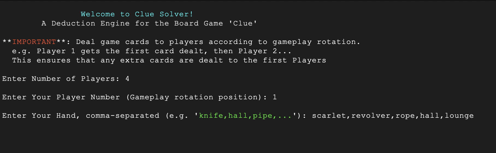
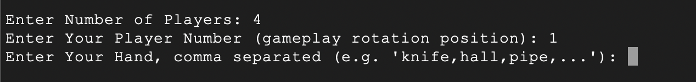
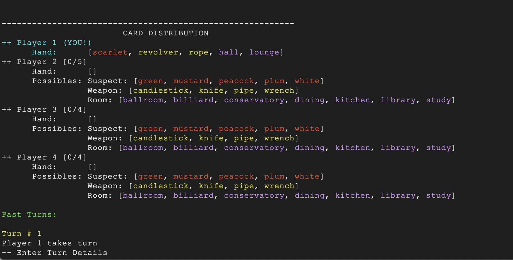
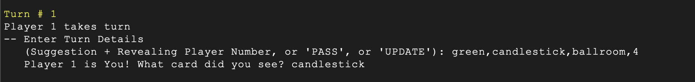
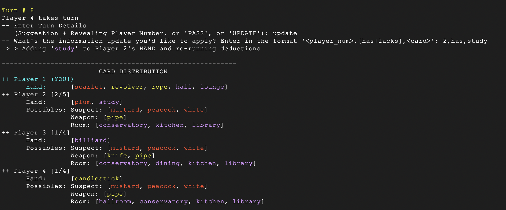
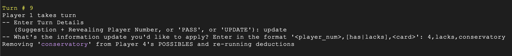
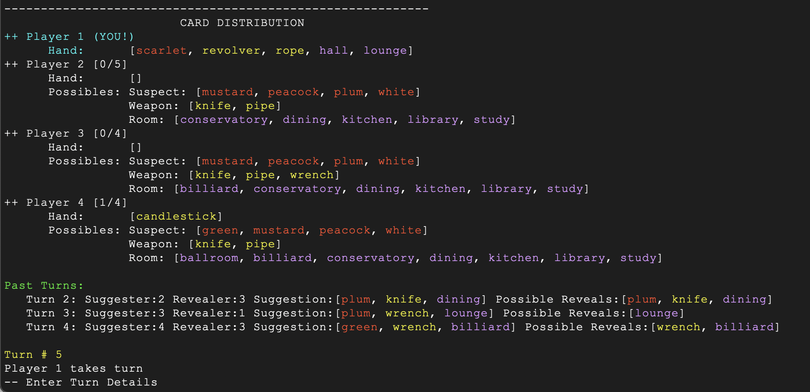
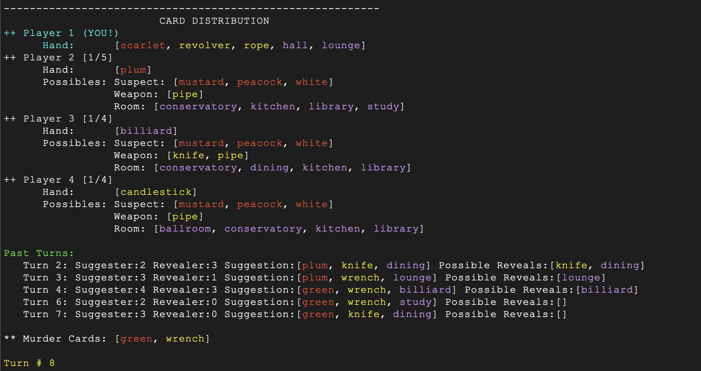

# Clue Board Game "Solver"

## What Does It Do?
This is a utility written in Python to help you win at the board game Clue (aka Cluedo outside the US).

As you play Clue, whether virtually or in-person, use the tool to manually enter the details about each successive Turn taken during the game. Turn details includes the Player who is making a suggestion about the murder, the Player who reveals a card to refute that suggestion (if any), as well as when a Player does not make a suggestion on a given Turn. 

This tool keeps track of the cards in your hand, Turn order, and what it knows about the other Players' hands. As more details become available with successive Turns, the tool uses a deep process of elimination to deduce what other Players are holding. With enough Turns, it will be able to deduce the winning Accusation for you... ideally before someone else has!

Think of this utility as applying the principles of card counting to playing a kid's board/card game. Enjoy!

**Please Note**: This tool does not play the game for you, meaning it does not tell you what to guess on your Turn. However, you WILL be empowered to make better guesses with the details provided!

---

## How do I start using it?

1. Download this project `clue_solver` to your desktop
2. In a terminal or console, navigate to this project's root folder and run the file `clue_solver.py`
```term
>>> python3 clue_solver.py
```
3. Follow the prompts in the terminal to set up the game and begin playing!
    + See the section below [Setting up the Game](#setting-up-the-game) for more details

---

## Setting Up The Game

<figure>
    
    <figcaption>Welcome / Setup screen when you startup the Clue Solver tool</figcaption>
</figure>

When starting the tool, it will ask you to enter the following details:

    1. The total number of players
    2. Your "Player Number", where you are in the rotation (1, 2, 3,...)
    3. The cards in your hand

<figure>
    
    <figcaption>Entering the cards in your HAND before the game starts</figcaption>
</figure>

**Entering Your Hand at the Game's Start**
  + Enter the contents of your hand as a comma-delimited list of values, with no whitespace. e.g.
    `>>> Enter Your Hand, comma separated (e.g. 'knife,hall,pipe,...'): study,green,white,rope,kitchen`
  + The card values must match elements of the lists `SUSPECT`, `WEAPON`, and `ROOM` defined in `./defs.py`
    + e.g. the Lead Pipe should simply be entered as `pipe`
    + e.g. Colonel Mustard should be entered as `mustard`
  + No whitespace, only alpha-strings separated by commas, and order of cards **does not matter**


**Caution: When Dealing Cards to Players**
+ **Please Note** that the tool determines the size of each Player's hand based on the total number of players and the size of the deck (21 cards in the standard game, however you may change this to suit your board! See [Configuration](#configuration) below). 
+ Depending on the number of Players, not all Players will have the same number of cards in their hand. E.g. when there are 4 Players, and playing with the standard 21-card deck, two Players will have 5 cards in their hand and the others will have 4 cards.
+ Deal cards one at a time in Round Robin order: Player 1 gets one card, then Player 2, then Player 3, etc.
  * When there are 'leftover' cards, they should be distributed to the first players in the rotation (starting with Player 1)

---

## Game Screen & Gameplay

On each turn, the user will view and interact with the Game Screen.
The Game Screen is divided into three sections.

<figure>
    
    <figcaption>Typical turn screen, showing Card Distribution, Past Turns, and Current Turn</figcaption>
</figure>

### Card Distribution
This section displays the KNOWN and POSSIBLE cards for each Player, including the user.
+ For visual organization, cards are grouped and colored according to their Category (Suspect, Weapon, Room).
+ Next to a Player name is a ratio [X/Y] indicating the number of known cards in their HAND relative to the size of their HAND.
+ As successive Turns yield more information about who does or doesn't hold certain cards, this section will update.

### Turn History
This section displays information about all past turns.
+ Details include the Player who made the murder suggestion (the 'Suggester'), the Player who revealed a Clue card to the Suggester (the 'Revealer'), and the set of cards that could have possibly been the Revealed card.
+ As the Engine works its deductive magic throughout the game, the set of `possible reveals` for Turns will get narrowed down.
+ Note that Turns in which You, the user, was the Suggester are not included in this Turn History, as it can not offer any insights into other Player's HANDS.

### Current Turn Prompt
This section offers a prompt to the user to enter the details of the current Turn.
+ For details on how to interact with this prompt, see section [Entering A Turn](#entering-a-turn)

---
## Entering a Turn

Players tell the Engine what happens next at the **Current Turn Prompt** section of the Game Screen.

Players have 3 options for input:

### Suggestion & Reveal
Specify when a Player (including yourself, the user) makes a suggestion about the murder and is shown a Clue card by another player
+ The Engine already knows which Player is the Suggester
+ Your entry must include the 3 cards that composed the Suggestion (Suspect, Weapon, Room), as well as the numeric ID of the Player that revealed a card to the Suggester.
  + e.g. `green,rope,kitchen,3` <--- This means that Player 3 showed a card to whomever suggested that it was Mr. Green in the Kitchen with the Rope
  + If No Player revealed a card on this Turn (meaning, no one had any of those cards), enter `0` as the Player ID
  + The order of cards does not matter, but they must come before the Player ID. Comma-delimited, no spaces.
+ If You, the user, were the Suggester, the Engine will ask you what card was revealed to you. Respond by entering the value of the card when prompted.
<figure>
    
    <figcaption>How to Enter Turn when You are the Suggester and are shown a card</figcaption>
</figure>

### Player Passes
If a Player does not enter a room or make a suggestion during their Turn, this is considered a "Pass". 
+ Enter `pass` in the prompt, and the Engine will proceed to the next Player.

### Manually Updating a Player's Hand Mid-Turn
By analysing the Card Distribution (or through some more crooked means...) you might become privy to knowledge about whether another Player HAS or LACKS a particular card. Before entering Turn details, you may manually update the Engine's knowledge with the `update` command

<figure>
    
    <figcaption>After entering 'update', you may specify whether a particular Player HAS or LACKS a card. The Card Distribution area will update, and you may then proceed with entering Turn details.</figcaption>
</figure>

**Update Process**
+ First, enter `update` at the prompt.
+ Then enter input of the format `<player_num>,[has|lacks],<card>` (comma-separated, no spaces)
    + e.g. `2,lacks,rope` <-- Player 2 does not have the 'rope' card, so it will be removed from their POSSIBLES
    + e.g. `3,has,green` <-- Player 3 has the 'green' card, so it will be added to their HAND and removed from **everyone's** POSSIBLES

Note that you can perform multiple updates on a Turn! You simply have to trigger each update separately with the `update` command.
<figure>
    
    <figcaption>After each update, the Engine will re-run all its deductive logic, potentially solving more of the game for you</figcaption>
</figure>


---
## Gamestate Updates Over Time

As Turns progress, the Engine will figure out what cards are in the Players' HANDS and update the Card Distribution screen. All you have to do is be diligent about entering the Turn details.

<figure>
    
    <figcaption>Players Cards after Turn 4</figcaption>
</figure>

<figure>
    
    <figcaption>Players Cards after Turn 7. Note Players 2 and 3 have cards added to their HANDS, and Players' POSSIBLES have been reduced due to process of elimination</figcaption>
</figure>

---
## Configuration

**The Cards, according to Clue Solver**

This tool assumes the following naming of Suspects, Weapons, and Rooms, by default:
```python
SUSPECT = ['white', 'plum', 'peacock', 'scarlet', 'mustard', 'green']
WEAPON = ['rope', 'pipe', 'wrench', 'candlestick', 'knife', 'revolver']
ROOM = ['billiard', 'lounge', 'conservatory', 'kitchen', 'hall', 'dining', 'study', 'library', 'ballroom']
```
* If you are playing a variant that differs in the makeup of these categories, the only change you must make is in the `./defs.py` module. The rest will sort itself out automatically.
* Feel free to change / add cards in each category depending on the variant of Clue you are playing.


## Questions?

I'd love to know what you think!

+ Email: joseph.bertino@gmail.com
+ LinkedIn: http://linkedin.com/in/joseph-bertino
+ Instagram: @yetixhunting